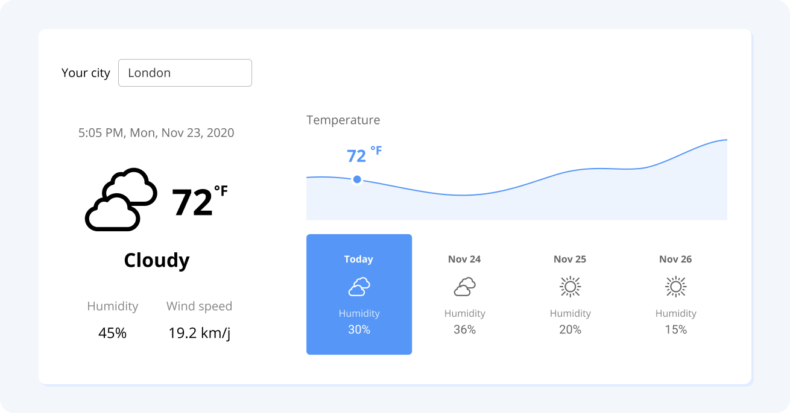

## Introdução

Faça um aplicativo da web para os usuários verem o tempo atual e a previsão do tempo para os próximos 7 dias.

## Requisitos

Crie um aplicativo React

Uma entrada para os usuários digitarem o nome da cidade

Exibe o clima atual, incluindo condições climáticas, temperatura, umidade, velocidade do vento e data e hora
Visualização para exibir a mudança de temperatura, mudança de umidade e condições climáticas de cada dia.

A imagem a seguir mostra uma maneira de implementar a IU. 

Sinta-se à vontade para interpretar os requisitos como quiser!

Demonstração do projeto do site de previsão do tempo

## Implementação Sugerida

Buscar a posição do dispositivo do usuário. 

Se você não conseguir obter a posição do usuário, defina Londres como o local padrão.

Obter dados meteorológicos (dados de previsão e dados meteorológicos atuais) da localização da API meteorológica
Formate os dados em gráficos
* Exibir o gráfico e o clima atual

Referências:

* Criar aplicativo React
* Obtendo a posição do dispositivo
* Chart.js : gráficos de JavaScript
* OpenWeather fornece APIs de dados meteorológicos